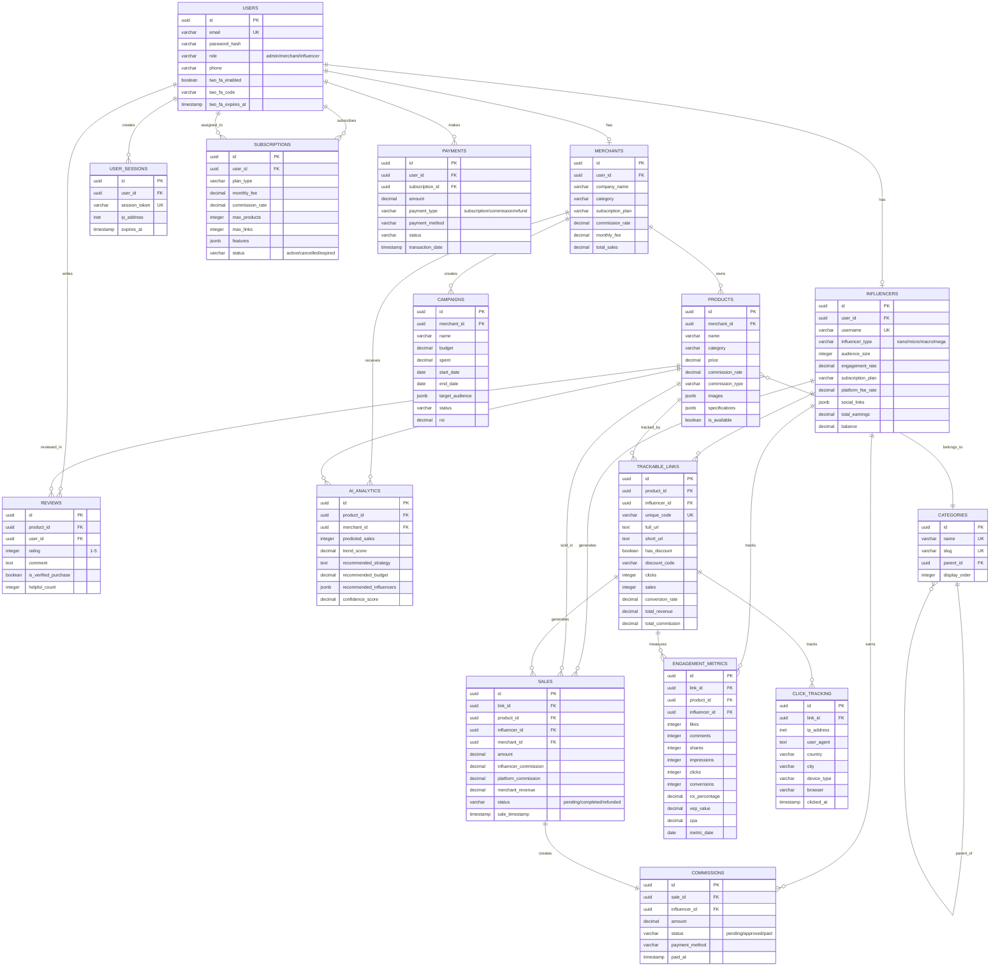

# 📊 DIAGRAMME ENTITÉ-RELATION - SHAREYOURSALES

## Vue d'ensemble des Relations



---

## 🔗 RELATIONS DÉTAILLÉES

### Relations 1:1 (One-to-One)
- **users ↔ merchants**: Un utilisateur peut être un merchant
- **users ↔ influencers**: Un utilisateur peut être un influenceur
- **sales → commissions**: Une vente crée une commission

### Relations 1:N (One-to-Many)
- **users → user_sessions**: Un utilisateur peut avoir plusieurs sessions
- **users → subscriptions**: Un utilisateur peut avoir plusieurs abonnements (historique)
- **users → payments**: Un utilisateur effectue plusieurs paiements
- **users → reviews**: Un utilisateur peut écrire plusieurs avis
- **merchants → products**: Un merchant possède plusieurs produits
- **merchants → campaigns**: Un merchant crée plusieurs campagnes
- **influencers → trackable_links**: Un influenceur génère plusieurs liens
- **influencers → sales**: Un influenceur génère plusieurs ventes
- **influencers → commissions**: Un influenceur reçoit plusieurs commissions
- **products → trackable_links**: Un produit peut avoir plusieurs liens d'affiliation
- **products → sales**: Un produit peut être vendu plusieurs fois
- **products → reviews**: Un produit peut avoir plusieurs avis
- **trackable_links → click_tracking**: Un lien enregistre plusieurs clics
- **trackable_links → sales**: Un lien génère plusieurs ventes
- **categories → categories**: Hiérarchie de catégories (parent/enfant)

### Relations N:M (Many-to-Many)
- **influencers ↔ products** (via trackable_links): Plusieurs influenceurs peuvent promouvoir plusieurs produits

---

## 🔑 CONTRAINTES D'INTÉGRITÉ

### Clés Primaires (PK)
Toutes les tables utilisent **UUID** comme clé primaire pour:
- Sécurité (non prévisible)
- Distribution (compatible avec systèmes distribués)
- Universalité (compatible avec Supabase)

### Clés Étrangères (FK)
Toutes avec `ON DELETE CASCADE` ou `ON DELETE SET NULL`:
- **CASCADE**: Suppression en cascade (ex: supprimer un user supprime ses sessions)
- **SET NULL**: Mise à NULL (ex: supprimer un user ne supprime pas les ventes, juste met user_id à NULL)

### Contraintes UNIQUE
- `users.email`
- `influencers.username`
- `trackable_links.unique_code`
- `trackable_links(product_id, influencer_id)` - Combinaison unique
- `categories.name`, `categories.slug`

### Contraintes CHECK
- `users.role IN ('admin', 'merchant', 'influencer')`
- `reviews.rating BETWEEN 1 AND 5`
- `sales.status IN ('pending', 'completed', 'refunded', 'cancelled')`

---

## 📊 CARDINALITÉS

```
USERS (1) ----< USER_SESSIONS (N)
USERS (1) ----< SUBSCRIPTIONS (N)
USERS (1) ----< PAYMENTS (N)
USERS (1) ----< REVIEWS (N)
USERS (1) ----< MERCHANTS (1)
USERS (1) ----< INFLUENCERS (1)

MERCHANTS (1) ----< PRODUCTS (N)
MERCHANTS (1) ----< CAMPAIGNS (N)
MERCHANTS (1) ----< AI_ANALYTICS (N)

INFLUENCERS (1) ----< TRACKABLE_LINKS (N)
INFLUENCERS (1) ----< SALES (N)
INFLUENCERS (1) ----< COMMISSIONS (N)
INFLUENCERS (1) ----< ENGAGEMENT_METRICS (N)

PRODUCTS (1) ----< TRACKABLE_LINKS (N)
PRODUCTS (1) ----< SALES (N)
PRODUCTS (1) ----< REVIEWS (N)
PRODUCTS (N) ----< CATEGORIES (1)

TRACKABLE_LINKS (1) ----< CLICK_TRACKING (N)
TRACKABLE_LINKS (1) ----< SALES (N)
TRACKABLE_LINKS (1) ----< ENGAGEMENT_METRICS (1)

SALES (1) ----< COMMISSIONS (1)
```

---

## 🔄 FLUX DE DONNÉES

### Flux d'inscription Influenceur
```
1. INSERT INTO users (role='influencer')
   ↓
2. INSERT INTO influencers (user_id)
   ↓
3. INSERT INTO subscriptions (user_id, plan_type='influencer_starter')
```

### Flux de création de lien d'affiliation
```
1. Influenceur sélectionne produit
   ↓
2. Génération unique_code
   ↓
3. INSERT INTO trackable_links (product_id, influencer_id, unique_code)
   ↓
4. Génération full_url et short_url
```

### Flux de vente
```
1. Clic sur lien → INSERT INTO click_tracking
   ↓
2. Achat → INSERT INTO sales
   ↓
3. Calcul commissions → INSERT INTO commissions (status='pending')
   ↓
4. UPDATE trackable_links (clicks++, sales++, total_revenue, conversion_rate)
   ↓
5. INSERT/UPDATE engagement_metrics
   ↓
6. UPDATE influencers (total_sales++, balance)
   ↓
7. UPDATE merchants (total_sales, total_commission_paid)
```

### Flux de paiement
```
1. Admin approuve → UPDATE commissions (status='approved')
   ↓
2. Traitement paiement → INSERT INTO payments
   ↓
3. Confirmation → UPDATE commissions (status='paid', paid_at, transaction_id)
   ↓
4. UPDATE influencers (balance -= amount, total_earnings += amount)
```

---

## 🎯 INDEX POUR PERFORMANCE

### Index sur Clés Étrangères
```sql
CREATE INDEX idx_merchants_user_id ON merchants(user_id);
CREATE INDEX idx_influencers_user_id ON influencers(user_id);
CREATE INDEX idx_products_merchant_id ON products(merchant_id);
CREATE INDEX idx_trackable_links_product ON trackable_links(product_id);
CREATE INDEX idx_trackable_links_influencer ON trackable_links(influencer_id);
CREATE INDEX idx_sales_link_id ON sales(link_id);
CREATE INDEX idx_commissions_influencer_id ON commissions(influencer_id);
```

### Index sur Recherches Fréquentes
```sql
CREATE INDEX idx_users_email ON users(email);
CREATE INDEX idx_influencers_username ON influencers(username);
CREATE INDEX idx_trackable_links_code ON trackable_links(unique_code);
CREATE INDEX idx_sales_timestamp ON sales(sale_timestamp);
CREATE INDEX idx_click_tracking_ip ON click_tracking(ip_address);
```

---

## 📈 VUES MATÉRIALISÉES (Optionnel)

Pour améliorer les performances des rapports:

```sql
-- Vue matérialisée pour dashboard influenceur
CREATE MATERIALIZED VIEW mv_influencer_dashboard AS
SELECT 
    i.id,
    i.username,
    COUNT(DISTINCT tl.id) as total_links,
    SUM(tl.clicks) as total_clicks,
    SUM(tl.sales) as total_sales,
    SUM(tl.total_commission) as total_commission,
    i.balance
FROM influencers i
LEFT JOIN trackable_links tl ON i.id = tl.influencer_id
GROUP BY i.id;

-- Rafraîchir toutes les heures
REFRESH MATERIALIZED VIEW mv_influencer_dashboard;
```

---

## 🔐 SÉCURITÉ PAR RÔLE (RLS - Supabase)

```sql
-- Row Level Security pour influencers
ALTER TABLE influencers ENABLE ROW LEVEL SECURITY;

-- Politique: Influenceur voit seulement ses données
CREATE POLICY influencer_own_data ON influencers
    FOR ALL
    USING (user_id = auth.uid());

-- Politique: Admin voit tout
CREATE POLICY admin_all_data ON influencers
    FOR ALL
    USING (
        EXISTS (
            SELECT 1 FROM users 
            WHERE id = auth.uid() AND role = 'admin'
        )
    );
```

---

**Légende:**
- **PK** = Primary Key
- **FK** = Foreign Key
- **UK** = Unique Key
- **(1)** = One
- **(N)** = Many
- **→** = One-to-One
- **↔** = Many-to-Many
- **----<** = One-to-Many
